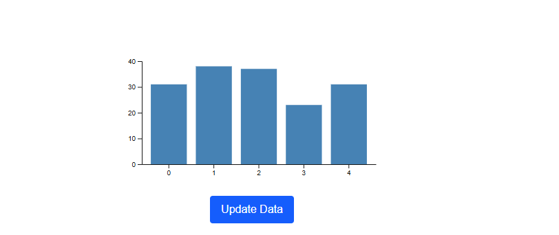
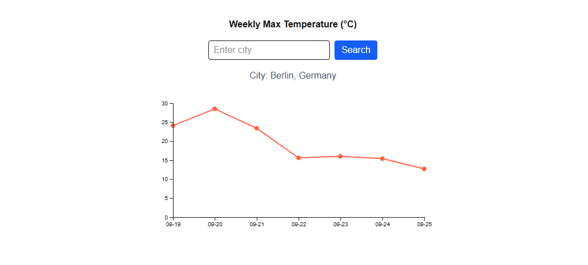

# React + D3 Examples

This repository contains small examples of how to integrate **React**, **TypeScript**, and **D3.js** for building interactive data visualizations.  
It is designed as a showcase project for learning and demonstrating frontend + dataviz skills.

---

## 📊 Examples

### 1. Dynamic Bar Chart
An interactive bar chart where the data updates randomly when clicking the button.  
- **Tech:** React, TypeScript, D3  
- **Concepts:** update pattern, scales, axes, transitions  



---

### 2. Weekly Line Chart (with real API)
A line chart displaying the **7-day max temperature forecast** for any city.  
- **Tech:** React, TypeScript, D3, Open-Meteo API  
- **Features:**  
  - Fetch city coordinates (Geocoding API)  
  - Fetch real weather data (Forecast API)  
  - Display as a responsive line chart with labels  



---

## 🛠️ Tech Stack
- [Next.js](https://nextjs.org/) (React + TypeScript + App Router)  
- [Tailwind CSS](https://tailwindcss.com/) (styling)  
- [D3.js](https://d3js.org/) (data visualization)  
- [Open-Meteo API](https://open-meteo.com/) (real weather data)  

---

## 🏃 Getting Started

1. Clone the repo:
   ```bash
   git clone https://github.com/Z-Mosayebi/react-d3-examples.git
   cd react-d3-examples
   ```

2. Install dependencies:
   ```bash
   npm install
   ```

3. Run development server:
   ```bash
   npm run dev
   ```

4. Open in your browser:
   ```
   http://localhost:3000
   ```

---

## 📌 Notes
- This project is built for **learning and demonstration purposes**.  
- Contributions and improvements are welcome!  

---

## 📄 License
MIT License
